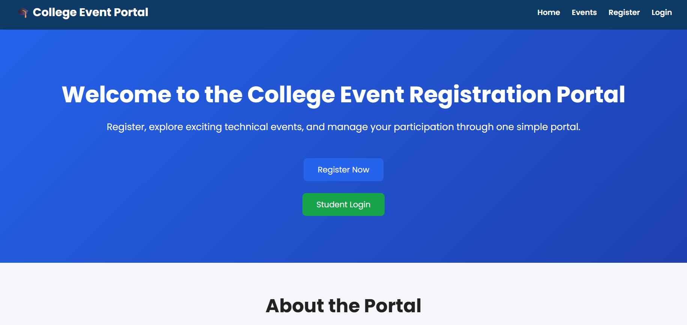
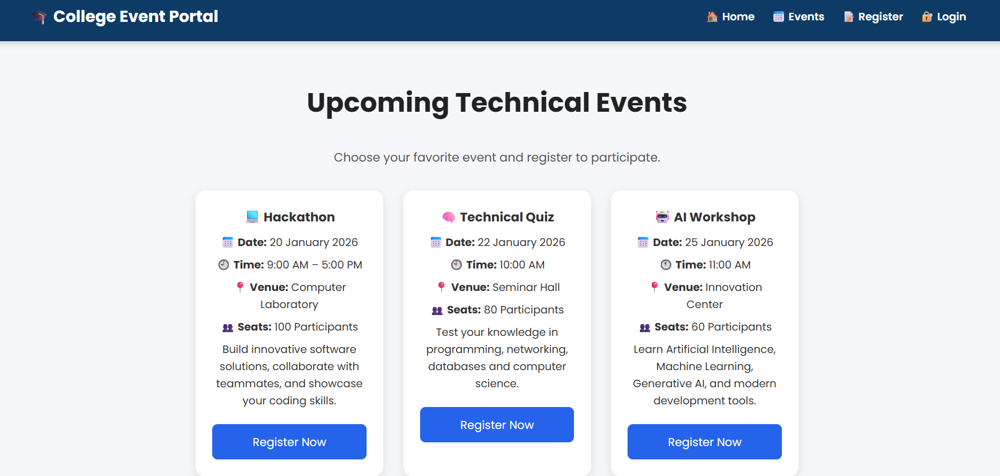
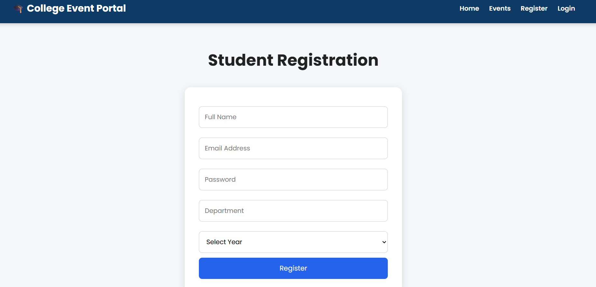
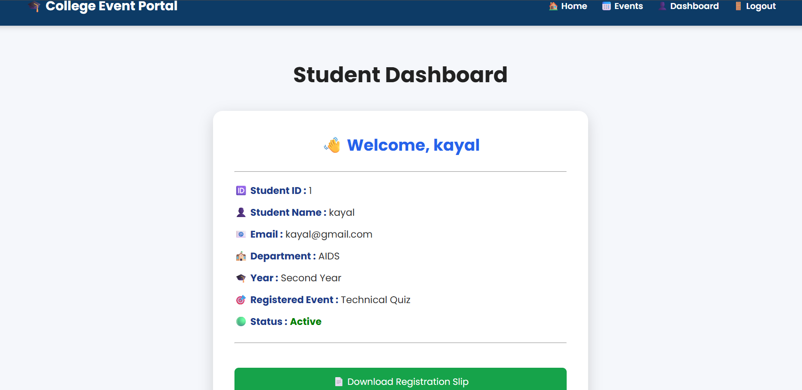
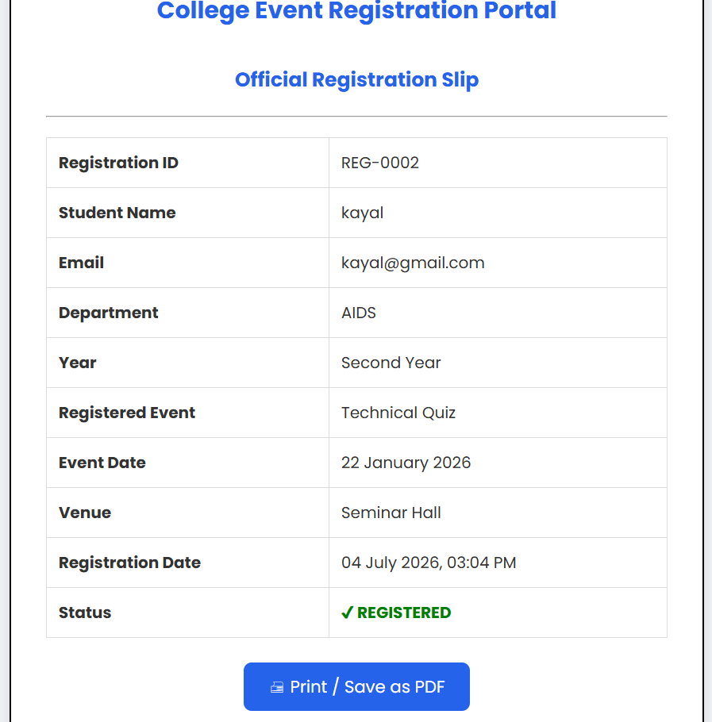
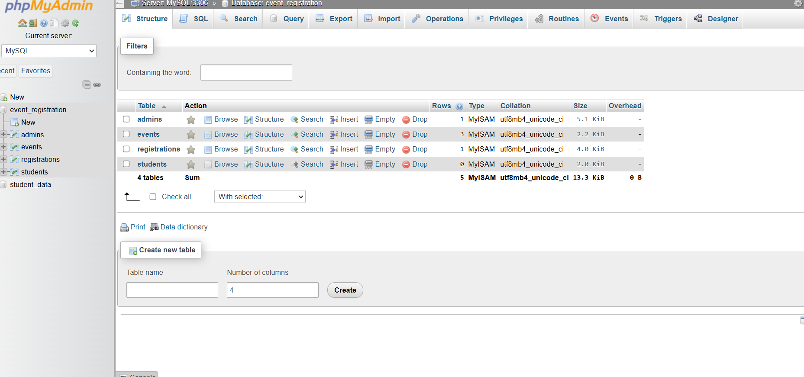

# 🎓 College Event Registration Portal

A web-based Event Registration Portal developed using HTML, CSS, JavaScript, PHP, and MySQL. The system allows students to register, log in, participate in technical events, and download their registration slip. It also provides an admin dashboard to manage registrations.

---

## 🚀 Features

- Student Registration
- Student Login
- Event Registration
- Dashboard
- Registration Slip Download
- Admin Dashboard
- MySQL Database Integration

---

## 🛠 Technologies Used

- HTML5
- CSS3
- JavaScript
- PHP
- MySQL
- WAMP Server

---

## 📂 Project Structure

backend/
css/
database/
diagrams/
docs/
images/
js/
screenshots/

---

## 📸 Screenshots

### Home Page

### Events Page

### Registration Page

### Student Dashboard

### Registration Slip

### Database

---

## 🗄 Database

Import the SQL file located in:

database/event_registration.sql

using phpMyAdmin.

---

## 👩‍💻 Author

**Tamizhini G**

GitHub:
https://github.com/tamizhinigopal-tech